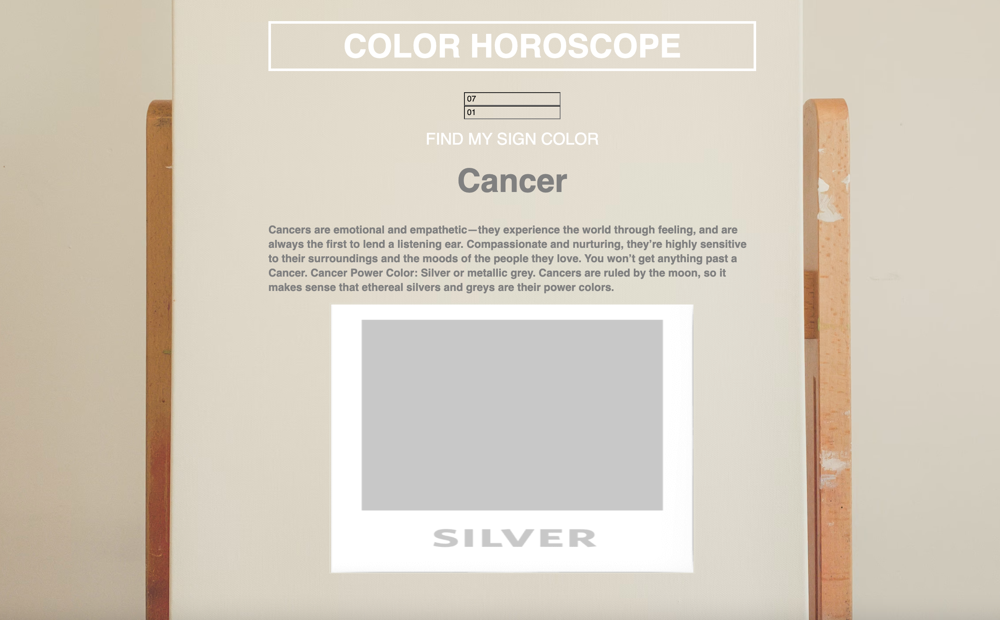

# 🎰 Week05 Bootcamp2019 Project: Horoscope

### Goal: Build a Simple Horoscope

This is my simple horoscope project! Users can input their birthday (month/day) and then receive a color horoscope based on their input.

</img>

Link to live site: [https://danielmtran-horoscope.netlify.app]

### How It's Made:

Tech used: HTML, CSS, JAVASCRIPT

I made the basic styling and layout of the app via HTML and CSS. The main functionality of the app was made using Javascript.

### Optimizations:

I added additional styling to the fonts and images.

### Lessons Learned:

I would like to come back to this project and potentially add more different readings + color shades 